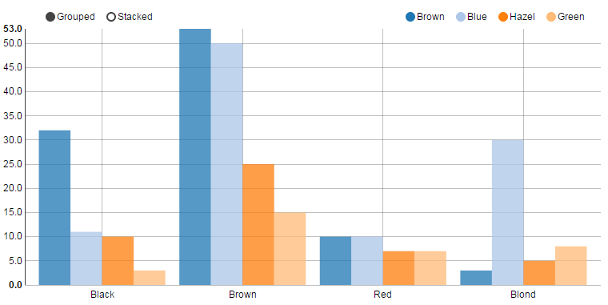
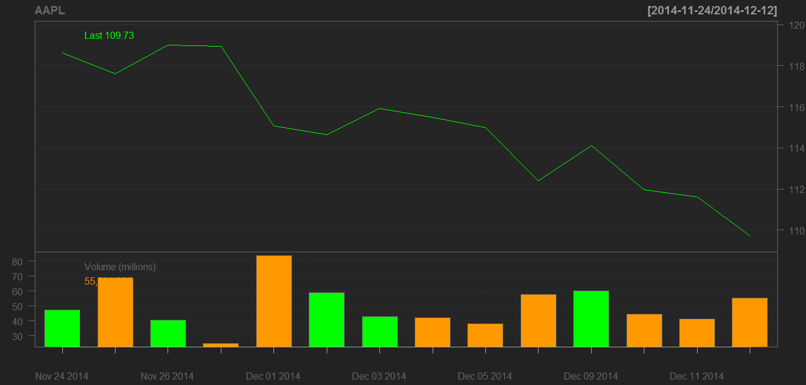

# Working with R 

## Introduction

[R](http://www.r-project.org/) is a freely available language and environment for statistical computing and graphics. R provides statistical and graphical techniques. The R environment seems quite similar to the [MatLab](http://uk.mathworks.com/products/matlab/) environment. 

## Initial Steps

Download and Install __R__ on your machine from [CRAN Web site](http://cran.r-project.org/)

[CRAN](http://cran.r-project.org/) is a network of ftp and web servers that store code and documentation for R.

Open the R program

Show the current working directory using:
<pre>> getwd()</pre>

I created a new folder for my workspace on the c: and set this as the working directory using
<pre>> setwd("c:\\my_new_R_Working_dir")</pre>

You could also have used the File/Change Dir menu options
 

## Using rCharts visualisation package

[rCharts](http://ramnathv.github.io/rCharts/) is an R package created by [Ramnath Vaidyanathan](https://github.com/ramnathv/rCharts) that allows you to use javascript visualisations (i.e. plots) with R. 

First install the _devtools_ package.
<pre>> install.packages("devtools")</pre>

You are prompted to select a CRAN server to download from - please select one

The package will then download automatically
To view all the libraries:
<pre>> library()</pre>
To view paths to the libraries use:
<pre>> .libPaths()</pre>

Now _require_ the _devtools_ package:
<pre>> require(devtools)</pre>

The _rCharts_ package is not hosted on [CRAN](http://cran.r-project.org/) you need to install it from GitHub:
<pre>> install_github('rCharts','ramnathv')
</pre>

Check that rCharts is now listed under your libraries:
<pre>> library()
</pre>

Load the rCharts library:
<pre>> library(rCharts)
</pre>

The following will show all resources including packages available in a session: 
<pre>> sessionInfo()</pre>

__rCharts should now be ready to use__

### Test Out rCharts

You should now be able to run the examples give on the [rCharts GitHub site](http://ramnathv.github.io/rCharts/).
The following is one of the examples given there. Enter the code below into __R__ and you should be presented with a new html page with a plot rendered on it. 

<pre>
> hair_eye_male <- subset(as.data.frame(HairEyeColor), Sex == "Male")
> nPlot(Freq ~ Hair, group = "Eye", data = hair_eye_male, type = "multiBarChart")
</pre>

Note: Firefox is not rendering the plot and instead is giving the following console error: 
<pre>
"ReferenceError: _ is not defined" in index.html 
</pre> 

However the plot is rendered perfectly in Chrome.

	

## Quantmod Financial Analysis

Quantmod is a financial analysis package developed by [Jeffrey Ryan](http://blog.revolutionanalytics.com/2011/07/the-r-files-jeff-ryan.html). Its GitHub repository is [here](https://github.com/R-Finance/quantmod). Quantmod lets you get, analyze and graph stock data.

Clear the console window and remove all elements from the workspace:
<pre>
> ls()
> CTRL+L
> rm(list=ls())
> ls()
</pre>

Install the __Quantmod package__ and load the library:
<pre>
> install.packages('quantmod')
> library('quantmod')
</pre>

Get the stock market data for AAPL. An AAPL variable is stored in the workspace. dim() gets the dimensions of the dataset. fix()shows the data contained in the variable.
<pre>
> getSymbols("AAPL")
> ls()
> dim(AAPL)
> fix(AAPL)
</pre>

Plot a lineChart (other options are barChart, candleChart etc) for AAPL for the last 14 days:
<pre>
> lineChart(AAPL, subset="last 14 days")
</pre>

	

# Statistical Learning #

A good book in the area seems to be _"An Introduction to Statistical Learning
with Applications in R"_, by Gareth James, Daniela Witten, Trevor Hastie and Robert Tibshirani (Springer).

The book has a dedicated Web site [here](http://www-bcf.usc.edu/~gareth/ISL/) where you can download the book in PDF format. You can also download datasets and R-code files that are related to excercises within the text. The following is based on examples taken from this book.

## Step 1 - Get a clean dataset to work with

Clear the console window and remove all elements from the workspace:
<pre>
> CTRL+L
> rm(list=ls())
> ls()
</pre>

Download the datasets that accompany the _"An Introduction to Statistical Learning with Applications in R"_ book from [here](http://www-bcf.usc.edu/~gareth/ISL/). Save the datasets in the working directory so R can use them. 
open the _auto.xls_ dataset with Excel. Notice that the top row contains the column headings. Also note that some of the data entries have a "?" to indicate the value is unknown.

We shall read the _auto.csv_ dataset into _R_. 
- _header=TRUE_ tells R that the first row of the dataset contains field names. 
- _na.strings="?"_ tells R to add _NA_ for every data entry that contains a "?" i.e. unknown value 

<pre>
> Auto=read.csv (" Auto.csv", header =TRUE, na.strings ="?")
> fix(Auto)
> dim(Auto)
> ls()
</pre>

We now have a variable called Auto which holds the dataset.

To see the field variable names within the dataset:
<pre>
> names(Auto)
</pre>

In this case we will remove all the dataset rows that contain an unknown value because is only effects a small number of rows of the dataset. The dimension of the dataset should now be reduced.

<pre>
> Auto = na.omit(Auto)
> dim(Auto)
</pre>

__Now we have a clean dataset to work with__

Ref.
http://www.computerworld.com/article/2497164/business-intelligence-beginner-s-guide-to-r-get-your-data-into-r.html?page=4
https://sites.google.com/site/manabusakamoto/home/r-tutorials/r-tutorial-1
http://blog.revolutionanalytics.com/2011/07/the-r-files-jeff-ryan.html
https://github.com/jaryan

Michael Cullen 2014

