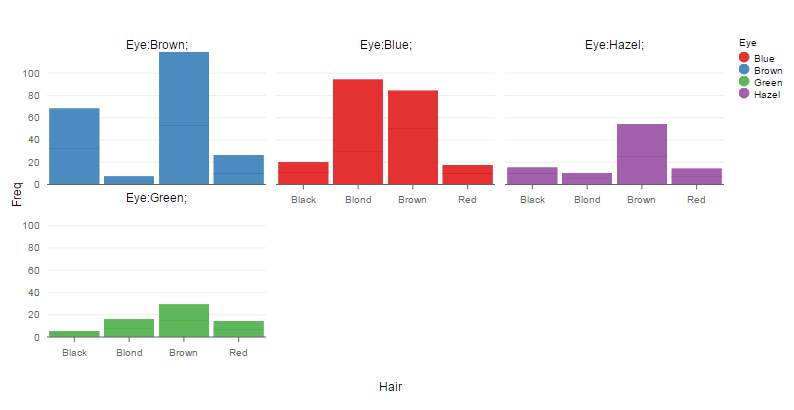

# Working with R 

## Introduction

[R](http://www.r-project.org/) is a freely available language and environment for statistical computing and graphics. R provides a wide variety of statistical and graphical techniques. The R environment is quite similar to [MatLabs](http://uk.mathworks.com/products/matlab/).

## Initial Steps

Download and Install __R__ on your machine from [CRAN Web site](http://cran.r-project.org/)

[CRAN](http://cran.r-project.org/) is a network of ftp and web servers that store code and documentation for R.

Open the R program

Show the current working directory using:
<pre>>getwd()</pre>

I created a new folder for my workspace on the c: and set this as the working directory using
<pre>>setwd("c:\\my_new_R_Working_dir")</pre>

You could also have used the File/Change Dir menu options
 

## Using rCharts visualisation package

[rCharts](http://ramnathv.github.io/rCharts/) is an R package created by [Ramnath Vaidyanathan](https://github.com/ramnathv/rCharts) that allows you to use javascript visualisations (i.e. plots) with R. 

First install the _devtools_ package.
<pre>>install.packages("devtools")</pre>

You are prompted to select a CRAN server to download from - please select one

The package will then download automatically
To view all the libraries:
<pre>>library()</pre>
To view paths to the libraries use:
<pre>>.libPaths()</pre>

Now _require_ the _devtools_ package:
<pre>>require(devtools)</pre>

The _rCharts_ package is not hosted on [CRAN](http://cran.r-project.org/) you need to install it from GitHub:
<pre>>install_github('rCharts','ramnathv')</pre>

Check that rCharts is now listed under your libraries:
<pre>>library()</pre>

Load the rCharts library:
<pre>>library(rCharts)</pre>

__rCharts should now be ready to use__

###Test Out rCharts

You should now be able to run the examples give on the [rCharts GitHub site](http://ramnathv.github.io/rCharts/).
The following is one of the examples given there. Enter the code below into __R__ and you should be presented with a new html page with a plot rendered in it. 
<pre>
> hair_eye = as.data.frame(HairEyeColor)
> rPlot(Freq ~ Hair | Eye, color = 'Eye', data = hair_eye, type = 'bar')
</pre>

Note: Firefox is not rendering the plot and instead is giving the following console error: 
<pre>"ReferenceError: _ is not defined" in index.html </pre> 
However the plot is rendered perfectly in Chrome.

	

Michael Cullen 2014

